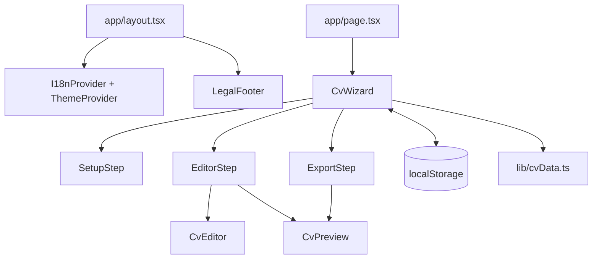

# Arquitectura

La aplicación es frontend-only. Next.js entrega código estático y React mantiene el CV en memoria. `localStorage` ofrece persistencia opcional en el mismo navegador.

## Capas reales

- **Rutas:** `app/` decide qué componente aparece por URL y define metadata.
- **Orquestación:** `CvWizard` posee `CvData`, paso actual e inicialización.
- **UI:** pasos, editor, preview, privacidad y footer.
- **Dominio ligero:** tipos de `lib/types.ts` y operaciones de `lib/cvData.ts`.
- **Datos declarativos:** muestras, temas y textos traducidos.
- **Persistencia:** acceso directo y acotado a dos claves de `localStorage`.

## Next.js App Router

`app/layout.tsx` envuelve todas las rutas y recibe `children: React.ReactNode`. `app/page.tsx` representa `/`; `app/privacy/page.tsx`, `/privacy`. La página de privacidad exporta `metadata`; el layout exporta metadata y viewport globales.

Los archivos de `app/` son Server Components mientras no lleven `"use client"`. `app/page.tsx` solo compone `CvWizard`; no necesita hooks. La mayoría de la UI es cliente porque usa hooks, eventos, `window`, impresión o almacenamiento.

## Renderizado

El build muestra `/` y `/privacy` como contenido estático. Tras descargar HTML/JavaScript, React hidrata los Client Components. `CvWizard` espera a su primer `useEffect` antes de mostrar el flujo para evitar asumir `localStorage` durante renderizado servidor.

## Límites arquitectónicos

No hay llamadas `fetch`, repositorios, controladores HTTP, ORM ni servicios externos. Añadir sincronización remota cambiaría la arquitectura, privacidad y modelo de errores; no debería introducirse solo dentro de un componente.
