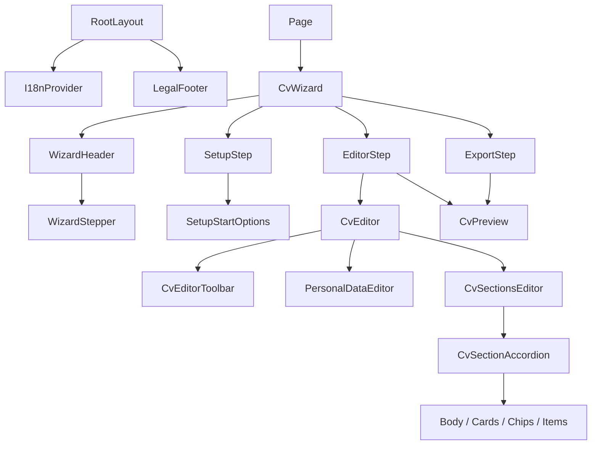

# Componentes

## Orquestación y pasos

### `CvWizard` — `components/wizard/CvWizard.tsx`

Responsabilidad: fuente de verdad y transición Setup → Editor → Export. Props: ninguna. Estado: `CvData | null`, paso y estado de inicialización/importación. Hooks: `useState`, tres `useEffect`, `useMemo`, `useI18n`. Lee/escribe almacenamiento y pasa `onChange={setData}`.

### `WizardHeader` / `WizardStepper`

Reciben `activeStep: WizardStep`. Renderizan marca, selector de UI y progreso; no modifican el CV. En móvil el stepper es texto compacto.

### `SetupStep`

Recibe idioma, modo, CV guardado, nombre/error de importación y callbacks. Usa `useRef` para el selector de archivo. `SetupStartOptions` presenta cards, activa el input y descarga el fixture JSON.

### `EditorStep`

Recibe `data`, tema, temas y callbacks. Estado interno: `mobileView: "edit" | "preview"`. En desktop muestra editor y preview; en móvil alterna. Contiene navegación sticky.

### `ExportStep`

Recibe CV/tema y callbacks. Calcula warnings de nombre/experiencia, reutiliza `CvPreview`, exporta JSON mediante el padre y ejecuta `window.print()`.

## Editor

### `CvEditor`

Coordina actualizaciones inmutables y operaciones de página/sección. `CvEditorToolbar` selecciona tema y acciones. `PersonalDataEditor` edita `CvData["personal"]`. `CvSectionsEditor` itera secciones.

### `CvSectionAccordion`

Props: `section`, `pageCount`, `onPatch`, `onRemove`. Edita título, página, columna, enabled y delega el contenido según qué propiedad opcional exista.

### Editores especializados

- `BodyItemsEditor`: array de strings.
- `CardsEditor`: `CvCard[]`.
- `ChipGroupsEditor`: `ChipGroup[]`, drafts y Enter.
- `ItemsEditor`: `CvItem[]` para experiencia.

Todos reciben valor y `onChange`; no conocen `CvData` completo.

## Presentación y globales

### `CvPreview`

Recibe `CvData` y `ThemePreset`; no modifica datos. Separa secciones por página/columna y renderiza A4. `SectionRenderer` elige body, chips, cards e items. Mide el contenedor para escala visual.

### `AppLanguageSwitcher` / `I18nProvider`

El selector consume Context. El provider posee idioma de UI, traducciones y tema MUI.

### `LegalFooter`

Footer global, enlace a privacidad y diálogo. `deleteApplicationLocalData` elimina claves propias y emite un evento.

### `PrivacyPageContent`

Recibe `contactEmail?: string` desde el Server Component de la ruta. Selecciona el copy según idioma y renderiza secciones; no contiene la política como hardcode JSX.
