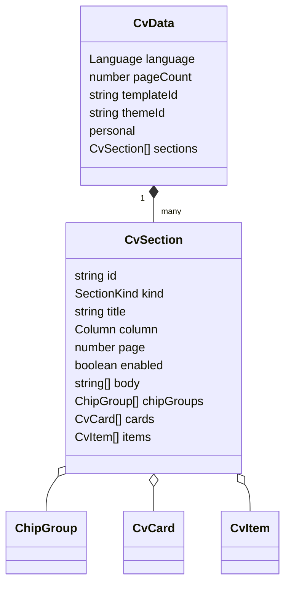

# Modelo de datos del CV

Todos los tipos viven en `lib/types.ts`.

## `CvData`

- `language: "es" | "en" | "ca"`: idioma base del contenido.
- `pageCount: number`: páginas A4 a renderizar.
- `templateId: string`: referencia a `templatePresets`; define la estructura visual.
- `themeId: string`: referencia a `themePresets`.
- `personal`: campos obligatorios `name`, `role`, `tags`, `photo`, `showPhoto`, `email`, `phone`, `github`, `linkedin`. La fotografía se guarda como Data URL local y `showPhoto` permite ocultarla sin borrarla.
- `sections: CvSection[]`: contenido distribuido manualmente.

## `CvSection`

`id`, `kind`, `title`, `column`, `page` y `enabled` son obligatorios. `column` solo acepta `sidebar` o `main`. `kind` es una unión de literales: `profile`, `chips`, `strengths`, `education`, `languages`, `experience`, `projects` o `custom`.

Los campos de contenido son opcionales porque cada clase usa una forma:

- `body?: string[]`: párrafos o líneas.
- `chipGroups?: ChipGroup[]`: grupo con `label` y `chips`.
- `cards?: CvCard[]`: `title` y `text`.
- `items?: CvItem[]`: experiencia estructurada.

`SectionKind` describe intención, pero no es una unión discriminada estricta: TypeScript no impide, por ejemplo, `kind: "profile"` con `cards`. La consistencia procede de los fixtures y editores.

## `CvItem`

`title` es obligatorio. `subtitle`, `date`, `description` y `bullets` son opcionales. En el preview, `date` admite saltos de línea; `bullets` crea una lista.

## Temas y archivos

`TemplatePreset` identifica las estructuras disponibles y `ThemePreset` contiene colores para variables CSS. `CvFile` en `lib/cvData.ts` envuelve `{ schemaVersion, cvData }`; no forma parte del estado React. `parseCvFile(value: unknown)` es la frontera de confianza: valida antes de devolver `CvData` y asigna la plantilla predeterminada a archivos antiguos.

Las plantillas disponibles se registran en `lib/templates.ts`. `CvPreview` mantiene un render independiente para la plantilla clásica y para Magna; esta última redistribuye las secciones por tipo en dos paneles editoriales.
