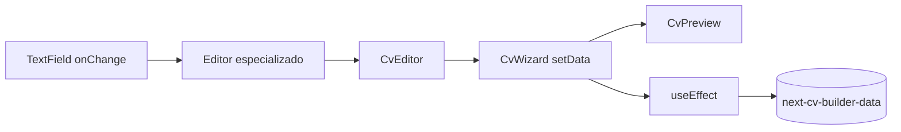
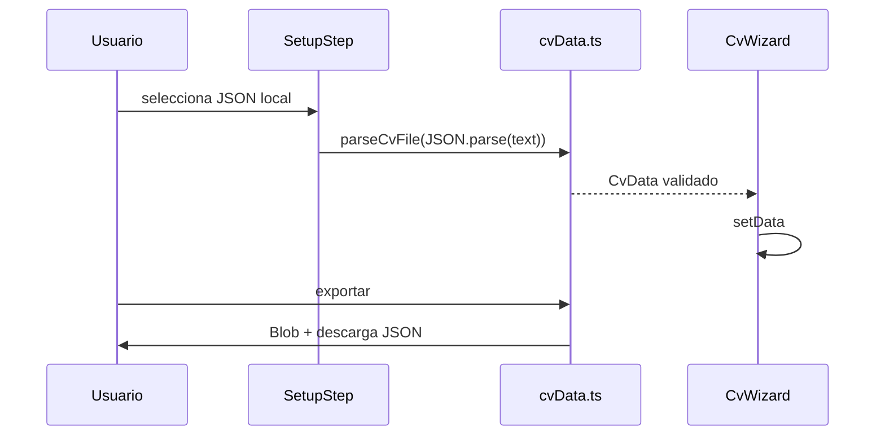

# Flujo de datos

`CvWizard` es la fuente de verdad del CV. Los hijos reciben datos por props y notifican cambios mediante callbacks.

## Escribir el nombre

1. `PersonalDataEditor` renderiza el `TextField` con `personal.name`.
2. `onChange("name", event.target.value)` llega a `CvEditor.patchPersonal`.
3. Se crea un objeto nuevo con spread; no se muta el anterior.
4. `CvWizard.setData` provoca un nuevo render.
5. `CvPreview` recibe el nuevo `CvData` y muestra el nombre.
6. Si el CV ya fue inicializado, un efecto serializa el estado en `localStorage`.

## Idiomas

Hay dos conceptos independientes:

- Idioma de UI: `I18nProvider` cambia `AppLanguage`, actualiza `<html lang>` y persiste `next-cv-builder-app-language`.
- Idioma del CV: `SetupStep` cambia `Language`; al continuar crea/carga datos ES o EN. No traduce automáticamente texto libre ya escrito.

## Secciones y páginas

`CvEditor` añade una `CvSection` personalizada a `sections`. `CvSectionAccordion` genera updates inmutables. Añadir página incrementa `pageCount`; mover una sección cambia `section.page`. El preview filtra por página y después por `sidebar` o `main`.

## Importar y exportar

`parseCvFile` acepta el envelope versionado o el formato antiguo sin envelope, valida runtime y corrige página, plantilla y tema. `exportCvData` crea un `Blob`; no usa red. PDF usa `window.print()`.
